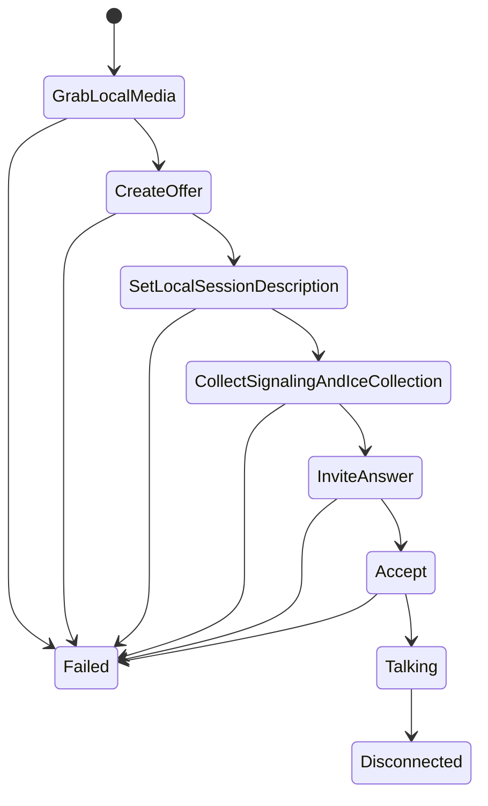

# Session State Diagram

```mermaid
stateDiagram-v2
    [*] --> GrabLocalMedia
    GrabLocalMedia --> CreateOffer
    GrabLocalMedia --> Failed
    CreateOffer --> SetLocalSessionDescription
    CreateOffer --> Failed
    SetLocalSessionDescription --> CollectSignalingAndIceCollection
    SetLocalSessionDescription --> Failed
    CollectSignalingAndIceCollection --> InviteAnswer
    CollectSignalingAndIceCollection --> Failed
    InviteAnswer --> Accept
    InviteAnswer --> Failed
    Accept --> Talking
    Accept --> Failed
    Talking --> Disconnected
```
